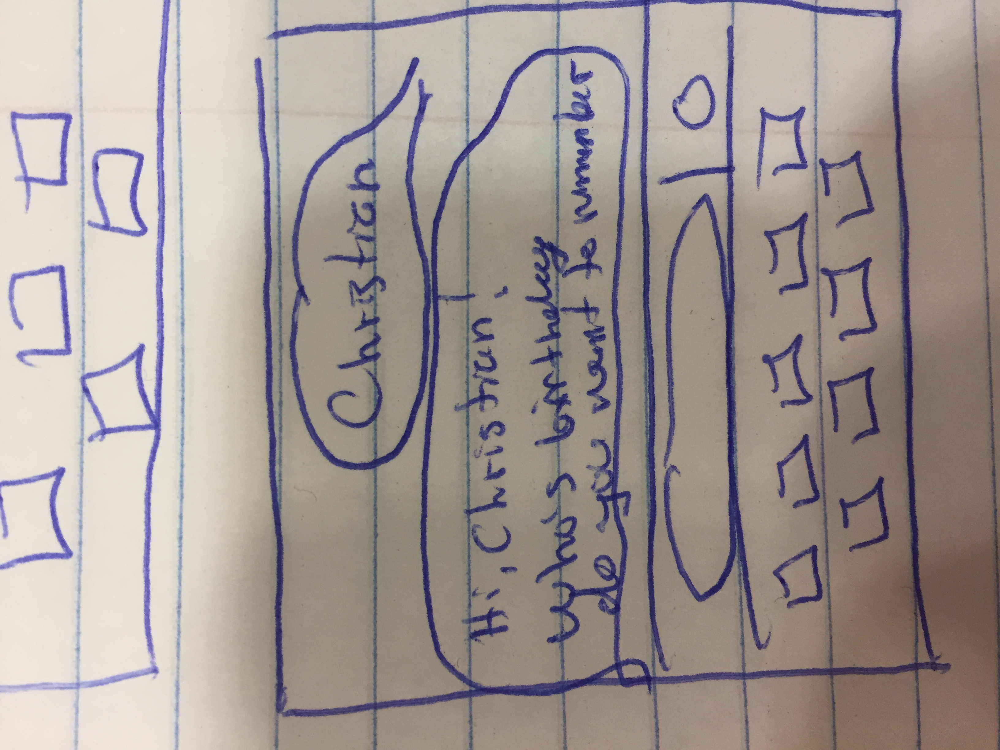

# Jarvis Your Personal Assistant 

## Side Note
Professor Veroza said that I could use a bot instead of a website for my proejct, therefore a form would work like a text message response taking in a friends information, or your own information. You can then ask to see your friends birthday by texting. 

## Overview

Everyday we have to remeber to do a lot of things, and honestly we forget most of them unless we have specific reminders set. However, one thing that may seem trivial but can have unforseen benefits is simply remebering to text/message someone on their birthday. According to Dale Carnegie's book "How to Win Friends and Inflence People" some of the most succesful men had a roledex that everyday they would look through to see if it was someone's birthday, anniversary, child's birthday etc.

Thus, Jarvis will be your personal assistant that through text messages reminds you about your friends' birthday's and other significiant dates, and even sends a message for you. 


## Data Model

The application will store a User's phone numbers,list of friends, and the birthday's (or whatever special dates) of friends. 

* users can have multiple friends
* each friend can have multiple dates associated with them
* there will only be one phone number per user


An Example User:

```javascript
{
  username: "christianmiljkovic",
  phoneNumber: "203-572-4630",
  hash: // a password hash,
  listsOfFriends: // an array of references to Friends documents
}
```

An Example List with Embedded Items:

```javascript
{
  username: // a reference to a User object
  phoneNumber: //a reference to the User's phone number,
  friends: [
    { name: {birthday:01/24/1995},{anniversary:03/23/2014}},
    { name: {birthday:02/04/1994},{child:{name:{birthday:12/19/1964}}}},
  ],
}
```


## [Link to Commented First Draft Schema](db.js) 

db.js - the database schema


## Wireframes


 Screen when first registering (sending the message)


 Screen when sending name


 Screen when responding with name



 Screen when adding friends 


## Site map


1. Sending message to jarvis -> 
2. (Welcome Screen) Jarvis responds asking what your name is -> 
3. (Registering) Responding to the name and storing it 
-> (Registering friends) 
4. Adding you friends and their birthdays -> 
5. (New Message from Jarvis) When date comes around Jarvis messages user saying "It's ____ birthday today. Would you like me to send a message for you?" -> 
6. (Send message screen) Jarvis either sends a stock message for the person, or the person will respond saying they will

## User Stories or Use Cases

1. as non-registered user, I can register a new account with Jarvis by texting the specific number
2. as a user, I can add friends and their birthdays
3. as a user, I can add friends' family members birthdays
4. as a user, I can view all of my friends and their birthday's associated with
5. as a user, I can add friends and their birthdays
6. as a user, I can change friends' information
7. as a user, I can delete friends and specific dates within a "friends" list
8. as a user, I can respond to Jarvis saying whether I will respond myself or have it respond

## Research Topics

* (5 points) Using Twillio API for SMS to send and recieve text messages over carrier network
-need a phone number, in the phone number in the console
-OUTBOUND MESSAGES:
  -Your app -> http post/messages -> twillio server -> someones phone 
-npm instasll twillo
-set up credientials with autoken and accountSid
-var client = require('twilio')(accountSid, authToken)
-client.message is like app.get with syntax:
  client.messages.create({to:some phone number
  from: your client phone number
  body: message
  }, (callback function) => {
  if(err){
    log it out
  }
  else{
  messageid
}
})

-INBOUND MESSAGES
user -> sends text to number -> twillio makes a http request to your server/app -> returns a TWIML which looks like <Response> <Message> Hi! </Message> </Response> -> which is then sent to the user
-They use http, express, and twilio
-use app.post('/sms',(req,res)=>{
  const twiml = new twilio.TwimlResponse();
  twiml.message('Your message here');
  res.writeHead(200, {'Content-Type':'text/xml'});
  res.end(twiml.toString());
})

-webhook is where you place the url given by heroku that hosts the web server


* (5 points) Most likely bot-dialog-manager or Recast.AI(some NLP module) so that Jarvis can take information in from user and respond to it accordingly

***SuperScript Library***

Found best Library to use called Superscript
You can use other AI frameworks like IBM watson and Wit.ai or API.ai (which all have NLP capabilities)
-Gives Message pipeline with NLP tech such as POS tagging, sentence analysis and question tagging.
-Dialog engine.
-WordNet, a database for word and concept expansion.
  -WordNet:WordNet is a large lexical database of English


Installation process:
npm install -g superscript
bot-init myBotName --clients twilio
cd myBotName
npm install
parse
npm run build
npm run start-[clientName]

Then you create a script:
+ hello human
- Hello Bot

where + matches all input types
- is the reply sent back to the user

This website gives a step by step instruction on how to implement the actual bot using super script:
https://medium.freecodecamp.org/creating-a-chat-bot-42861e6a2acd

This is a website that walks through the capabilities of SuperScript:
https://medium.com/@rob_ellis/superscript-ce40e9720bef

Here is the documentation for SuperScript:
https://github.com/superscriptjs/superscript/wiki

*** Ended up using API.ai instead to implement the chat bot dialog ***
Link to SDK on Github is here: https://github.com/dialogflow/dialogflow-nodejs-client
Link to website is here: https://dialogflow.com/

## [Link to Initial Main Project File](app.js) 


## Annotations / References Used


1. [botlerplate](https://github.com/RecastAI/botlerplate) 
2. [website on the recast.ai guide](https://recast.ai/) 
3. [twillio docs](https://www.twilio.com/docs/)
